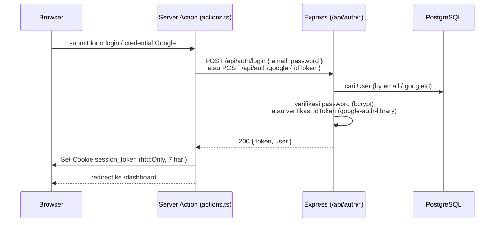
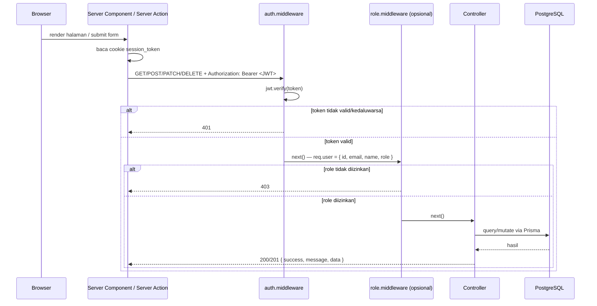
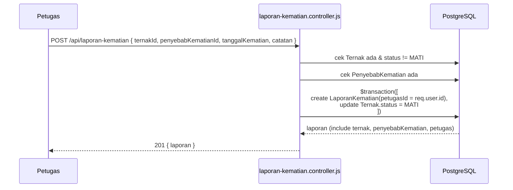
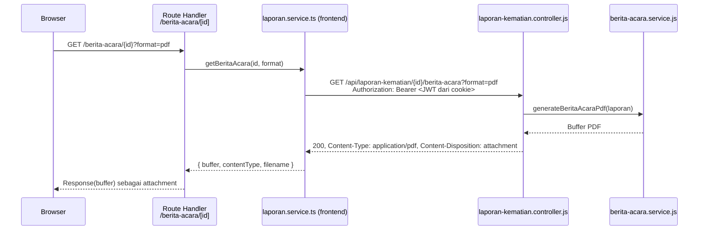

# API Flow

Diagram alur request untuk skenario-skenario utama. Semua endpoint memakai amplop response yang sama — lihat [api/error-response.md](../api/error-response.md).

## 1. Login (email/password atau Google)

## 2. Request terautentikasi (pola umum semua resource)

## 3. Buat laporan kematian (transaksi + perubahan status ternak)

Pola yang sama (dengan arah sebaliknya untuk status `HIDUP`) berlaku untuk `DELETE /api/laporan-kematian/:id`. Untuk laporan kelahiran, `POST /api/laporan-kelahiran` membuat baris `Ternak` **baru** sekaligus `LaporanKelahiran` dalam satu transaksi (lihat [api/laporan-kelahiran.md](../api/laporan-kelahiran.md)).

## 4. Unduh dokumen (Berita Acara / Akta Kelahiran)

Jika `format=docx` (default), backend memakai `docxtemplater` untuk mengisi template `.docx` alih-alih menggambar PDF secara manual. Jika template tidak ditemukan di server, backend membalas `500` dengan `error` bertanda `TEMPLATE_NOT_FOUND`.
