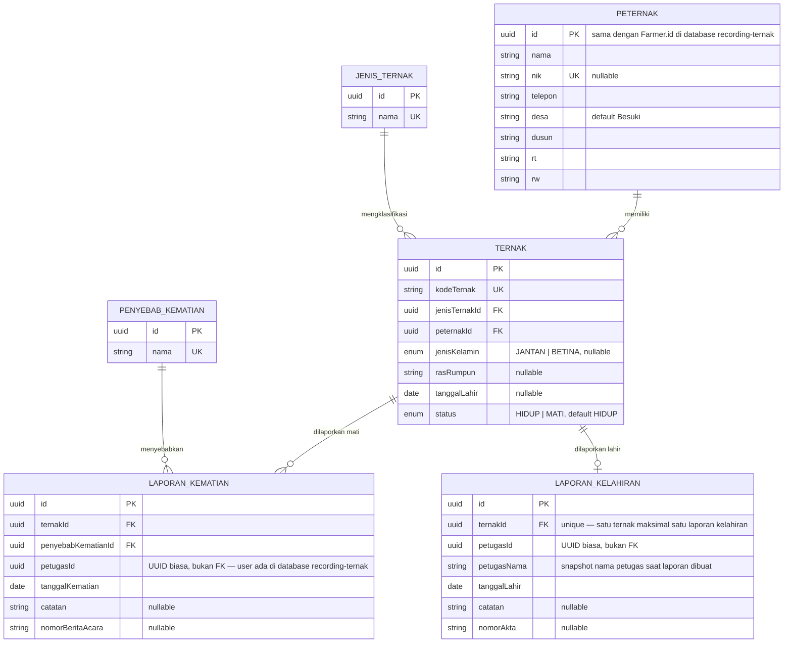

# Database Schema

Sumber kebenaran: `backend/prisma/schema.prisma`. Semua tabel memakai `id UUID` sebagai primary key (`@default(uuid())`), serta `createdAt`/`updatedAt` kecuali `JenisTernak` dan `PenyebabKematian` (tabel referensi murni).

> **Tidak ada tabel `users` lagi di database ini** sejak [ADR-005](../decisions/adr-005-integration-with-recording-ternak.md) — data user (auth, role) sepenuhnya dipindah ke database recording-ternak (model `Admin` di sana). Lihat bagian [Catatan Lintas Aplikasi](#catatan-lintas-aplikasi) di bawah.

## ERD

## Enum

| Enum | Nilai | Dipakai di |
|---|---|---|
| `JenisKelamin` | `JANTAN`, `BETINA` | `Ternak.jenisKelamin` |
| `StatusTernak` | `HIDUP`, `MATI` | `Ternak.status`, di-set otomatis oleh controller laporan kematian/kelahiran |

Role user (`SUPERADMIN`/`ADMIN`/`VIEWER`) sekarang di-definisikan di skema recording-ternak — lihat [ADR-005](../decisions/adr-005-integration-with-recording-ternak.md).

## Perilaku `onDelete` (penting untuk memahami respons error API)

| Relasi | onDelete | Efek |
|---|---|---|
| `Ternak.jenisTernak → JenisTernak` | `Restrict` | JenisTernak tidak bisa dihapus selama masih dipakai `Ternak` mana pun (→ `DELETE /api/jenis-ternak/:id` balas 400) |
| `Ternak.peternak → Peternak` | `Cascade` | Menghapus `Peternak` ikut menghapus semua `Ternak` miliknya |
| `LaporanKematian.ternak → Ternak` | `Restrict` | `Ternak` tidak bisa dihapus selama masih punya `LaporanKematian` (→ `DELETE /api/ternak/:id` balas 400) |
| `LaporanKematian.penyebabKematian → PenyebabKematian` | `Restrict` | `PenyebabKematian` tidak bisa dihapus selama masih dipakai laporan (→ 400) |
| `LaporanKelahiran.ternak → Ternak` | `Cascade` | Menghapus `LaporanKelahiran` lewat endpoint delete juga menghapus `Ternak` terkait (lihat `laporan-kelahiran.controller.js`, transaksi eksplisit) |

`petugasId` di `LaporanKematian`/`LaporanKelahiran` **tidak lagi** punya relasi/constraint FK (sejak ADR-005) — menghapus akun user di recording-ternak tidak divalidasi terhadap laporan yang pernah dia buat di sini.

Karena `Ternak.peternak` bersifat `Cascade` sedangkan `LaporanKematian.ternak` bersifat `Restrict`, menghapus seorang `Peternak` yang salah satu ternaknya sudah punya laporan kematian akan gagal di level database (foreign key violation) meski controller `peternak.controller.js` saat ini hanya menangani kode error `P2025`, bukan `P2003`, untuk kasus ini — lihat [setup/troubleshooting.md](../setup/troubleshooting.md).

## Catatan Lintas Aplikasi

- **Users** — tidak ada tabel lokal. `Admin` di database recording-ternak adalah satu-satunya sumber user untuk kedua aplikasi.
- **Peternak ↔ Farmer** — `Peternak` di sini punya baris berkorespondensi di tabel `Farmer` milik recording-ternak, **dengan id yang sama persis**. Keduanya disinkronkan lewat endpoint `/internal/*` di kedua aplikasi (lihat [`api/internal.md`](../api/internal.md)) setiap kali salah satu diubah.
- **Ternak dari recording-ternak selalu jenis `"Kambing"`** — dibuat lewat `POST /api/ternak/provision`, `kodeTernak` = ear tag number kambing (`String(earTagNumber)`). `jenisKelamin`/`tanggalLahir` bisa kosong saat pertama dibuat; lihat gate di [`api/laporan-kematian.md`](../api/laporan-kematian.md).

Lihat [ADR-005](../decisions/adr-005-integration-with-recording-ternak.md) untuk alasan desain ini.

## Konvensi penamaan kolom/tabel

- Nama model Prisma (PascalCase) di-`@@map` ke nama tabel snake_case (`LaporanKematian` → `laporan_kematian`).
- Field camelCase di-`@map` ke kolom snake_case (`tanggalKematian` → `tanggal_kematian`).
- Semua ID adalah `uuid` (`@db.Uuid`), bukan auto-increment integer.

Lihat juga [database/prisma.md](../database/prisma.md) untuk konvensi query dan migrasi.
