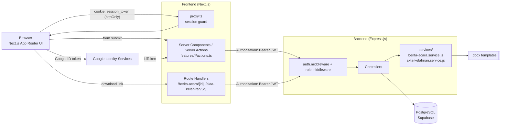

# System Design

## Ringkasan

Dashboard Kematian Hewan Ternak Desa Besuki adalah aplikasi dua-layer dalam satu monorepo:

- **Frontend** — Next.js 16 (App Router) yang merender halaman dashboard, formulir pencatatan, dan mengunduh dokumen (DOCX/PDF) ke browser.
- **Backend** — Express.js 5 REST API yang menangani autentikasi, CRUD data, generate dokumen (berita acara & akta kelahiran), dan agregasi statistik.
- **Database** — PostgreSQL yang di-hosting di Supabase, diakses lewat Prisma ORM (Prisma Client 7) dengan driver adapter `@prisma/adapter-pg`.

Kedua aplikasi berjalan sebagai proses terpisah (lihat `npm run dev` di root, memakai `concurrently`) dan berkomunikasi lewat HTTP/JSON. Frontend tidak pernah mengakses database secara langsung — semua akses data lewat backend API.

## Komponen

## Alur autentikasi (ringkas)

1. User login lewat email/password atau tombol Google (`GoogleLogin` dari `@react-oauth/google`).
2. Server Action (`loginAction` / `googleLoginAction` di `frontend/src/features/auth/actions.ts`) memanggil backend (`POST /api/auth/login` atau `POST /api/auth/google`).
3. Backend memverifikasi kredensial (bcrypt untuk password, `google-auth-library` untuk ID token Google), lalu menandatangani JWT (`jsonwebtoken`, masa berlaku 7 hari).
4. Server Action menyimpan JWT sebagai cookie **httpOnly** (`session_token`) — bukan di localStorage atau state client.
5. Setiap request dari Server Component/Action ke backend menyertakan JWT itu sebagai header `Authorization: Bearer <token>` (lihat `frontend/src/lib/api-server.ts`).
6. `frontend/src/proxy.ts` (Next.js middleware) memeriksa keberadaan cookie ini untuk redirect ke `/login` atau `/dashboard`.

Detail lebih lanjut: [backend/authentication.md](../backend/authentication.md), [api/authentication.md](../api/authentication.md), [decisions/adr-002](../decisions/adr-002-httponly-cookie-session-server-actions.md).

## Generate dokumen

Dua jenis dokumen legal desa di-generate dari data laporan:

| Dokumen | Trigger | Service | Format |
|---|---|---|---|
| Berita Acara Kematian | `GET /api/laporan-kematian/:id/berita-acara` | `backend/src/services/berita-acara.service.js` | `.docx` (dari template) atau `.pdf` (digambar langsung via `pdfkit`) |
| Akta Kelahiran | `GET /api/laporan-kelahiran/:id/akta` | `backend/src/services/akta-kelahiran.service.js` | `.docx` (dari template) atau `.pdf` (digambar langsung via `pdfkit`) |

Frontend tidak memanggil endpoint ini langsung dari browser. Ada Route Handler proxy (`frontend/src/app/berita-acara/[id]/route.ts`, `frontend/src/app/akta-kelahiran/[id]/route.ts`) yang menyisipkan token session di sisi server lalu men-stream buffer file ke browser sebagai attachment — sehingga token JWT tidak pernah terekspos ke JavaScript sisi klien.

## Catatan status implementasi

Beberapa fitur yang di `CLAUDE.md` masih ditandai "belum dikerjakan" (integrasi frontend ke endpoint auth/CRUD) **sudah diimplementasikan penuh** di kode saat ini — lihat `frontend/src/features/`, `frontend/src/services/`, `frontend/src/app/(dashboard)/`. Dokumen ini mengacu ke kondisi kode terkini, bukan catatan tersebut.
